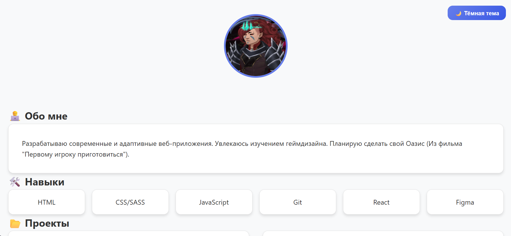
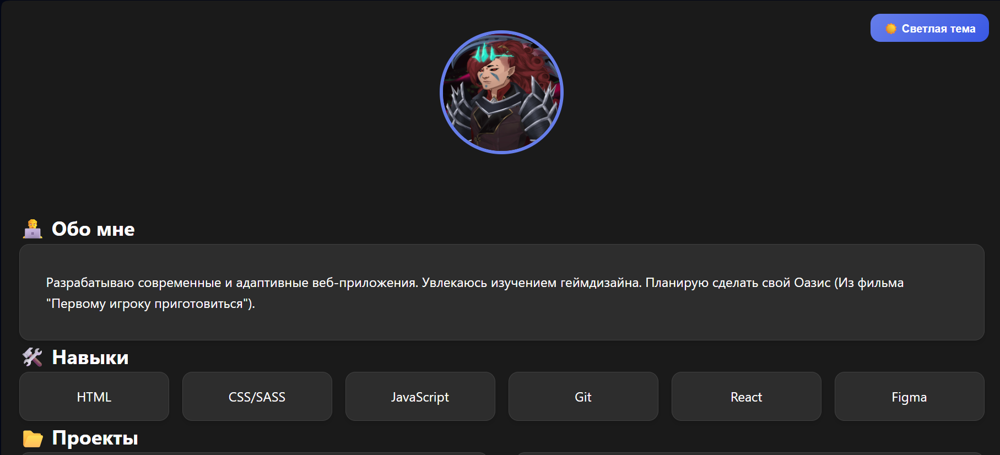

# Лабораторная работа №3

## Тема: CSS-препроцессоры - SASS/SCSS

### Цель работы:
- Познакомиться с концепцией CSS-препроцессоров
- Научиться компилировать SASS в обычный CSS
- Использовать переменные, вложенность, миксины и импорты

### Выполнение работы:

#### Использованные технологии:
- SASS/SCSS препроцессор
- Переменные для цветов и размеров
- Миксины для кнопок и карточек
- Медиазапросы через миксины
- Импорт компонентов

#### Структура проекта:

# Lab 3 - Портфолио

## Структура проекта

```
lab3/
├── index.html
├── README.md
├── avatar.jpg
└── styles/
|   ├── style.css
|   ├── style.scss
|   ├── style.css.map
|   ├── _variables.scss
|   ├── _mixins.scss
|   └── _dark-theme.scss
```


### Ответы на вопросы:

#### ❓ Почему выбрали этот препроцессор?
Выбран SASS/SCSS как современный стандарт с широким распространением в индустрии, мощными возможностями и хорошей поддержкой.

#### ❓ Какие файлы для компонентов препроцессора создавали?
- `_variables.scss` - переменные цветов, размеров, breakpoints
- `_mixins.scss` - миксины для медиазапросов, кнопок, карточек
- `_dark-theme.scss` - стили для тёмной темы
- `style.scss` - главный файл с импортами

#### ❓ Каким образом реализована тёмная тема страницы?
Через CSS-класс `.dark-theme` который применяется к body при клике на кнопку. Все цвета берутся из переменных SASS.

#### ❓ Какие запросы делали LLM?
- Генерация структуры SASS проекта
- Создание миксинов для адаптивности
- Реализация системы тем через переменные

### Ссылка на репозиторий:
https://github.com/Bloodluckcion/lab3

### Скриншоты:


